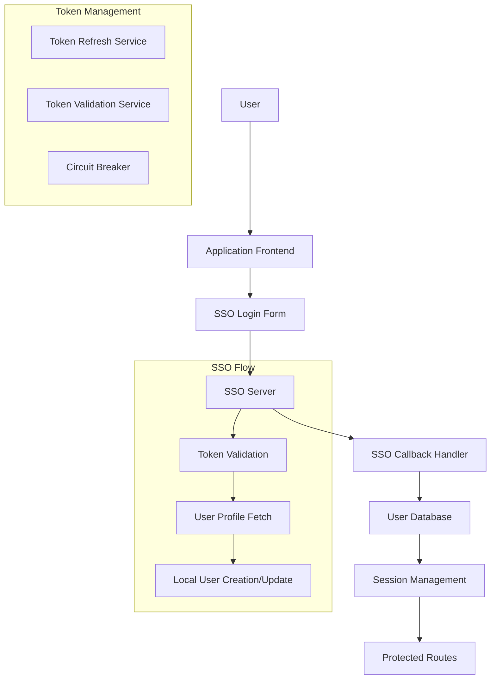
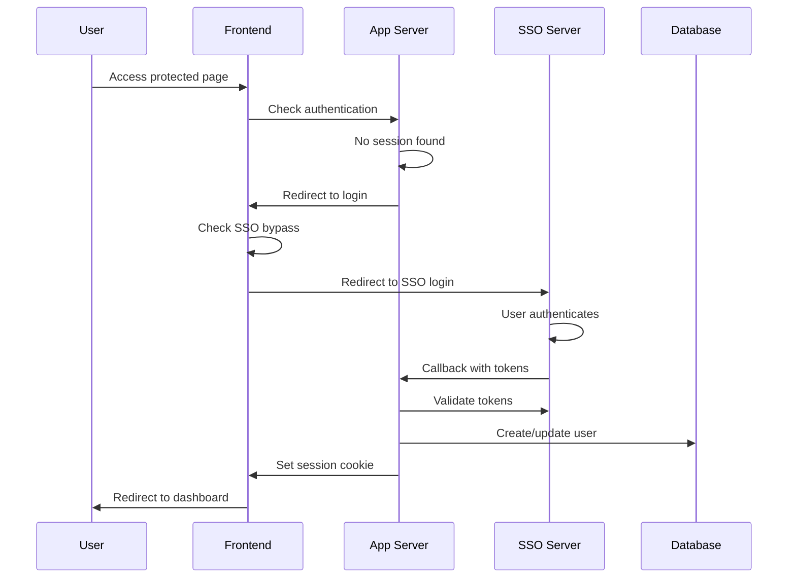
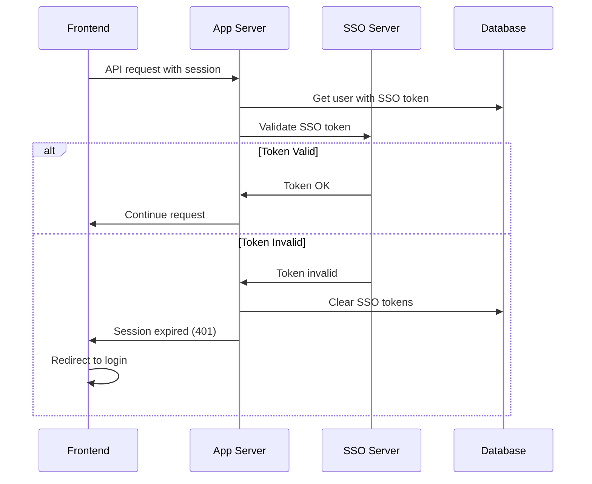

# SSO System Implementation Guide

This comprehensive guide documents the complete SSO (Single Sign-On) system implementation in the Richz-Log application. Use this guide to implement a similar SSO system in another application.

## Table of Contents

1. [System Overview](#system-overview)
2. [Architecture](#architecture)
3. [Database Schema](#database-schema)
4. [Environment Configuration](#environment-configuration)
5. [Core Components](#core-components)
6. [Authentication Flow](#authentication-flow)
7. [API Endpoints](#api-endpoints)
8. [Frontend Integration](#frontend-integration)
9. [Security Features](#security-features)
10. [Error Handling](#error-handling)
11. [Testing & Debugging](#testing--debugging)
12. [Production Deployment](#production-deployment)

## System Overview

The SSO system provides seamless integration between the application and an external SSO server, supporting:

- **Hybrid Authentication**: SSO-first with local fallback
- **Circuit Breaker Pattern**: Prevents infinite login loops
- **Token Management**: Automatic refresh and validation
- **User Synchronization**: Auto-creation and role mapping
- **Development Bypass**: Local development without SSO dependency

### Key Features

- 🔐 **Secure Token Management**: JWT tokens with automatic refresh
- 🔄 **Circuit Breaker**: Prevents SSO failure loops
- 🎯 **Same-Tab Authentication**: No popup blocking issues
- 🛡️ **Graceful Degradation**: Fallback to local authentication
- 📱 **Mobile-Friendly**: Works on all devices and browsers
- 🔧 **Development Mode**: Bypass SSO for local development

## Architecture



## Database Schema

### Required Database Changes

Add SSO-related fields to your user table:

```sql
-- Add SSO fields to user/pegawai table
ALTER TABLE pegawai 
ADD COLUMN IF NOT EXISTS "ssoAccessToken" TEXT,
ADD COLUMN IF NOT EXISTS "ssoRefreshToken" TEXT,
ADD COLUMN IF NOT EXISTS "ssoTokenExpiry" TIMESTAMP(3),
ADD COLUMN IF NOT EXISTS "ssoUserId" TEXT,
ADD COLUMN IF NOT EXISTS "ssoRoleId" TEXT,
ADD COLUMN IF NOT EXISTS "ssoCompanyId" TEXT;

-- Add indexes for performance
CREATE INDEX IF NOT EXISTS idx_pegawai_sso_user_id ON pegawai("ssoUserId");
CREATE INDEX IF NOT EXISTS idx_pegawai_sso_token_expiry ON pegawai("ssoTokenExpiry");
```

### Prisma Schema Example

```prisma
model Pegawai {
  id               Int       @id @default(autoincrement())
  username         String    @unique
  namaLengkap      String
  role             Role      @default(PROGRAMMER)
  
  // SSO Integration Fields
  ssoAccessToken   String?   // JWT access token from SSO
  ssoRefreshToken  String?   // JWT refresh token from SSO
  ssoTokenExpiry   DateTime? // Token expiration timestamp
  ssoUserId        String?   // SSO server user ID
  ssoRoleId        String?   // SSO server role ID
  ssoCompanyId     String?   // SSO server company ID
  
  @@map("pegawai")
}
```

## Environment Configuration

### Required Environment Variables

```env
# SSO Configuration
SSO_ENABLED=true                                    # Enable/disable SSO
SSO_BYPASS_FOR_DEV=false                           # Bypass SSO in development
SSO_BASE_URL=https://sso.yourcompany.com           # SSO server base URL
SSO_DASHBOARD_URL=https://sso.yourcompany.com      # SSO dashboard URL
SSO_API_URL=https://sso.yourcompany.com/api        # SSO API base URL
SSO_CALLBACK_URL=https://yourapp.com/api/auth/sso-callback # Callback URL

# Public URLs (for client-side)
NEXT_PUBLIC_SSO_BASE_URL=https://sso.yourcompany.com
NEXT_PUBLIC_SSO_DASHBOARD_URL=https://sso.yourcompany.com
NEXT_PUBLIC_SSO_API_URL=https://sso.yourcompany.com/api
NEXT_PUBLIC_SSO_CALLBACK_URL=https://yourapp.com/api/auth/sso-callback
NEXT_PUBLIC_APP_URL=https://yourapp.com
```

### Development Configuration

```env
# Development Override
SSO_BYPASS_FOR_DEV=true                            # Disable SSO for local dev
SSO_BASE_URL=http://localhost:4000                 # Local SSO server
NEXT_PUBLIC_SSO_BASE_URL=http://localhost:4000
```

## Core Components

### 1. SSO Configuration Service (`src/lib/ssoConfig.ts`)

```typescript
export interface SSOConfig {
  dashboardUrl: string;
  apiUrl: string;
  callbackUrl: string;
  appUrl: string;
  enabled: boolean;
}

export function getServerSSOConfig(): SSOConfig {
  return {
    dashboardUrl: process.env.SSO_DASHBOARD_URL || '',
    apiUrl: process.env.SSO_API_URL || '',
    callbackUrl: process.env.SSO_CALLBACK_URL || '',
    appUrl: process.env.NEXT_PUBLIC_APP_URL || '',
    enabled: process.env.SSO_ENABLED === 'true'
  };
}

export function getClientSSOConfig(): SSOConfig {
  return {
    dashboardUrl: process.env.NEXT_PUBLIC_SSO_DASHBOARD_URL || '',
    apiUrl: process.env.NEXT_PUBLIC_SSO_API_URL || '',
    callbackUrl: process.env.NEXT_PUBLIC_SSO_CALLBACK_URL || '',
    appUrl: process.env.NEXT_PUBLIC_APP_URL || '',
    enabled: process.env.SSO_ENABLED === 'true'
  };
}

export function getSSOLoginUrl(returnUrl?: string): string {
  const config = typeof window !== 'undefined' ? getClientSSOConfig() : getServerSSOConfig();
  const url = new URL('/login', config.dashboardUrl);
  if (returnUrl) {
    url.searchParams.set('return_url', returnUrl);
  }
  return url.toString();
}
```

### 2. SSO Service (`src/lib/sso.ts`)

```typescript
export class SSOError extends Error {
  constructor(message: string, public statusCode?: number) {
    super(message);
    this.name = 'SSOError';
  }
}

export async function loginWithSSO(request: SSOLoginRequest): Promise<SSOLoginResponse> {
  const loginUrl = getSSOApiUrl('/auth/login');
  const response = await fetch(loginUrl, {
    method: 'POST',
    headers: { 'Content-Type': 'application/json' },
    body: JSON.stringify(request),
  });

  if (!response.ok) {
    const errorData = await response.json().catch(() => ({}));
    throw new SSOError(
      errorData.message || errorData.error || 'SSO login failed',
      response.status
    );
  }

  return await response.json();
}

export async function validateSSOToken(accessToken: string): Promise<boolean> {
  try {
    const profileUrl = getSSOProfileUrl();
    const response = await fetch(profileUrl, {
      method: 'GET',
      headers: {
        'Authorization': `Bearer ${accessToken}`,
        'Content-Type': 'application/json',
      }
    });

    // Handle different response scenarios
    if (response.status === 429) {
      console.warn('[SSO] Rate limited - treating as valid to avoid logout loop');
      return true;
    }

    if (response.status >= 500) {
      console.warn('[SSO] Server error - treating as valid to avoid logout loop');
      return true;
    }

    return response.ok;
  } catch (error) {
    console.error('[SSO] Token validation error:', error);
    return false;
  }
}
```

### 3. Type Definitions (`src/types/sso.ts`)

```typescript
export interface SSOLoginRequest {
  username: string;
  password: string;
  otp?: string;
  client_public_ip?: string;
}

export interface SSOLoginResponse {
  access_token: string;
  refresh_token: string;
  token_type: string;
  expires_in: number;
  user: SSOUser;
}

export interface SSOUser {
  username: string;
  role_id: string;
  role_name: string;
  role: string;
  companyId: string;
  id_departemen: string;
  company_id: string;
}

export interface SSORefreshRequest {
  refresh_token: string;
}

export interface SSORefreshResponse {
  access_token: string;
  refresh_token: string;
  token_type: string;
  expires_in: number;
}
```

## Authentication Flow

### 1. Login Process



### 2. Token Validation



## API Endpoints

### 1. SSO Callback Handler (`/api/auth/sso-callback`)

```typescript
export async function GET(req: NextRequest) {
  const { searchParams } = new URL(req.url);
  
  // Extract OAuth parameters
  const access_token = searchParams.get('access_token');
  const refresh_token = searchParams.get('refresh_token');
  const expires_in = searchParams.get('expires_in');
  const username = searchParams.get('username');
  const error = searchParams.get('error');

  // Handle errors
  if (error) {
    return NextResponse.redirect('/signin?error=' + encodeURIComponent(error));
  }

  // Validate required parameters
  if (!access_token || !username) {
    return NextResponse.redirect('/signin?error=invalid_callback');
  }

  try {
    // Find or create local user
    let localUser = await prisma.pegawai.findFirst({
      where: {
        OR: [
          { username: username },
          { ssoUserId: username }
        ]
      }
    });

    if (!localUser) {
      // Create new user from SSO data
      localUser = await prisma.pegawai.create({
        data: {
          username: username,
          namaLengkap: username,
          role: 'PROGRAMMER',
          ssoUserId: username,
          ssoAccessToken: access_token,
          ssoRefreshToken: refresh_token,
          ssoTokenExpiry: expires_in ? 
            new Date(Date.now() + parseInt(expires_in) * 1000) : 
            new Date(Date.now() + 3600 * 1000),
        }
      });
    } else {
      // Update existing user with SSO tokens
      localUser = await prisma.pegawai.update({
        where: { id: localUser.id },
        data: {
          ssoUserId: username,
          ssoAccessToken: access_token,
          ssoRefreshToken: refresh_token,
          ssoTokenExpiry: expires_in ? 
            new Date(Date.now() + parseInt(expires_in) * 1000) : 
            new Date(Date.now() + 3600 * 1000),
        }
      });
    }

    // Create session
    const sessionToken = signSession({
      id: localUser.id,
      role: localUser.role,
      namaLengkap: localUser.namaLengkap,
      username: localUser.username
    });

    // Set cookie and redirect
    const response = NextResponse.redirect('/project-dashboard');
    response.cookies.set('session', sessionToken, {
      httpOnly: true,
      secure: process.env.NODE_ENV === 'production',
      sameSite: 'lax',
      path: '/',
      maxAge: 7 * 24 * 60 * 60 // 7 days
    });

    return response;
  } catch (error) {
    console.error('SSO callback failed:', error);
    return NextResponse.redirect('/signin?error=callback_failed');
  }
}
```

### 2. Authentication Check (`/api/auth/me`)

```typescript
export async function GET(req: Request) {
  const session = parseSessionFromCookieHeader(req.headers.get('cookie'));
  if (!session) {
    return NextResponse.json({ user: null });
  }

  const user = await prisma.pegawai.findUnique({
    where: { id: session.id }
  });

  if (!user) {
    return NextResponse.json({ user: null });
  }

  // SSO validation for users with SSO tokens
  if (isSSOEnabled() && user.ssoAccessToken && !isSSOBypassEnabled()) {
    try {
      const isTokenValid = await validateSSOToken(user.ssoAccessToken);
      
      if (!isTokenValid) {
        // Clear SSO tokens and force logout
        await prisma.pegawai.update({
          where: { id: user.id },
          data: {
            ssoAccessToken: null,
            ssoRefreshToken: null,
            ssoTokenExpiry: null,
          }
        });
        
        return NextResponse.json(
          { user: null, sessionExpired: true, reason: 'SSO token expired' },
          { status: 401 }
        );
      }
    } catch (error) {
      if (error instanceof SSOError) {
        // Clear tokens on SSO error
        await prisma.pegawai.update({
          where: { id: user.id },
          data: {
            ssoAccessToken: null,
            ssoRefreshToken: null,
            ssoTokenExpiry: null,
          }
        });
        
        return NextResponse.json(
          { user: null, sessionExpired: true, reason: 'SSO validation failed' },
          { status: 401 }
        );
      }
    }
  }

  // Return user data with SSO status
  const userWithSSOStatus = {
    ...user,
    ssoEnabled: isSSOEnabled() && !!user.ssoUserId,
    ssoTokenValid: user.ssoTokenExpiry ? new Date(user.ssoTokenExpiry) > new Date() : false
  };

  return NextResponse.json({ user: userWithSSOStatus });
}
```

## Frontend Integration

### 1. Sign-In Form with Circuit Breaker

```typescript
// Circuit breaker constants
const SSO_FAILURE_KEY = 'sso_failure_count';
const MAX_SSO_FAILURES = 2;
const FAILURE_RESET_TIME = 5 * 60 * 1000; // 5 minutes

function getSSOFailureCount(): number {
  if (typeof window === 'undefined') return 0;
  const stored = localStorage.getItem(SSO_FAILURE_KEY);
  if (!stored) return 0;
  
  const { count, timestamp } = JSON.parse(stored);
  if (Date.now() - timestamp > FAILURE_RESET_TIME) {
    localStorage.removeItem(SSO_FAILURE_KEY);
    return 0;
  }
  return count;
}

function incrementSSOFailureCount(): void {
  if (typeof window === 'undefined') return;
  const current = getSSOFailureCount();
  localStorage.setItem(SSO_FAILURE_KEY, JSON.stringify({
    count: current + 1,
    timestamp: Date.now()
  }));
}

export default function SignInForm() {
  const [ssoBlocked, setSsoBlocked] = useState(false);
  const [error, setError] = useState<string | null>(null);

  useEffect(() => {
    const handleAutoSSO = async () => {
      // Check circuit breaker
      const failureCount = getSSOFailureCount();
      if (failureCount >= MAX_SSO_FAILURES) {
        setSsoBlocked(true);
        setError('SSO temporarily disabled due to repeated failures');
        return;
      }

      // Check for error parameters
      const urlParams = new URLSearchParams(window.location.search);
      if (urlParams.has('error')) {
        incrementSSOFailureCount();
        const newCount = getSSOFailureCount();
        
        if (newCount >= MAX_SSO_FAILURES) {
          setSsoBlocked(true);
          setError('SSO authentication failed repeatedly');
        } else {
          setError(`SSO failed. ${MAX_SSO_FAILURES - newCount} attempts remaining`);
        }
        return;
      }

      // Redirect to SSO
      const config = getClientSSOConfig();
      const ssoLoginUrl = getSSOLoginUrl(config.callbackUrl);
      window.location.replace(ssoLoginUrl);
    };

    handleAutoSSO();
  }, []);

  const handleResetSSO = () => {
    localStorage.removeItem(SSO_FAILURE_KEY);
    setSsoBlocked(false);
    setError(null);
    window.location.reload();
  };

  return (
    <div>
      {ssoBlocked ? (
        <div>
          <p>{error}</p>
          <button onClick={handleResetSSO}>Reset SSO</button>
        </div>
      ) : (
        <div>Redirecting to SSO...</div>
      )}
    </div>
  );
}
```

### 2. Middleware for Route Protection

```typescript
export function middleware(request: NextRequest) {
  const { pathname } = request.nextUrl;
  
  // Skip middleware for API routes and static files
  if (
    pathname.startsWith('/api/') ||
    pathname.startsWith('/_next/') ||
    pathname.includes('.') ||
    pathname === '/signin'
  ) {
    return NextResponse.next();
  }

  // Check session cookie
  const sessionCookie = request.cookies.get('session');
  
  if (!sessionCookie && pathname !== '/signin') {
    return NextResponse.redirect(new URL('/signin', request.url));
  }

  return NextResponse.next();
}
```

## Security Features

### 1. Token Security

- **Secure Storage**: Tokens stored in httpOnly cookies
- **Encryption**: Consider encrypting tokens in database
- **Expiration**: Automatic token expiration and refresh
- **Validation**: Regular token validation with SSO server

### 2. Circuit Breaker Pattern

- **Failure Tracking**: Tracks SSO failures in localStorage
- **Automatic Reset**: 5-minute timeout for failure reset
- **User Control**: Manual reset option for users
- **Graceful Degradation**: Fallback to local authentication

### 3. CORS Configuration

```typescript
// Middleware CORS handling
const allowedOrigins = [
  'http://localhost:3000',
  process.env.NEXT_PUBLIC_SSO_DASHBOARD_URL,
  process.env.NEXT_PUBLIC_APP_URL,
];

if (request.method === 'OPTIONS') {
  return new NextResponse(null, {
    status: 200,
    headers: {
      'Access-Control-Allow-Origin': origin && allowedOrigins.includes(origin) ? origin : '*',
      'Access-Control-Allow-Methods': 'GET, POST, PUT, DELETE, OPTIONS',
      'Access-Control-Allow-Headers': 'Content-Type, Authorization',
      'Access-Control-Allow-Credentials': 'true',
    },
  });
}
```

## Error Handling

### 1. SSO Server Errors

```typescript
// Graceful handling of SSO server issues
if (response.status === 429) {
  console.warn('Rate limited - treating as valid token');
  return true; // Don't force logout on rate limit
}

if (response.status >= 500) {
  console.warn('Server error - treating as valid token');
  return true; // Don't force logout on server errors
}
```

### 2. Network Errors

```typescript
// Handle network connectivity issues
if (process.env.NODE_ENV === 'production' && error instanceof Error && (
  error.name === 'TimeoutError' || 
  error.name === 'AbortError' ||
  error.message.includes('ECONNRESET')
)) {
  console.warn('Network error in production - treating as valid token');
  return true;
}
```

### 3. User-Friendly Error Messages

```typescript
const getErrorMessage = (error: string) => {
  switch (error) {
    case 'invalid_callback':
      return 'SSO authentication failed. Please try again.';
    case 'oauth_code_flow_not_implemented':
      return 'OAuth code flow is not supported. Please contact support.';
    case 'direct_callback_access':
      return 'Direct access to callback URL is not allowed.';
    default:
      return 'Authentication failed. Please try again.';
  }
};
```

## Testing & Debugging

### 1. Debug Mode

Add `?debug=true` to the SSO callback URL to see detailed debug information:

```
https://yourapp.com/api/auth/sso-callback?debug=true
```

### 2. Environment Testing

```bash
# Test SSO configuration
curl -X GET "http://localhost:3000/api/debug/sso-config"

# Test token validation
curl -X POST "http://localhost:3000/api/auth/sso-login" \
  -H "Content-Type: application/json" \
  -d '{"username":"test","password":"password"}'
```

### 3. Logging Configuration

```env
# Enable detailed SSO logging
DEBUG=sso:*
NODE_ENV=development
```

## Production Deployment

### 1. Environment Variables

```env
# Production SSO Configuration
SSO_ENABLED=true
SSO_BYPASS_FOR_DEV=false
SSO_BASE_URL=https://sso.yourcompany.com
SSO_DASHBOARD_URL=https://sso.yourcompany.com
SSO_API_URL=https://sso.yourcompany.com/api
SSO_CALLBACK_URL=https://yourapp.com/api/auth/sso-callback

NEXT_PUBLIC_SSO_BASE_URL=https://sso.yourcompany.com
NEXT_PUBLIC_SSO_DASHBOARD_URL=https://sso.yourcompany.com
NEXT_PUBLIC_SSO_API_URL=https://sso.yourcompany.com/api
NEXT_PUBLIC_SSO_CALLBACK_URL=https://yourapp.com/api/auth/sso-callback
NEXT_PUBLIC_APP_URL=https://yourapp.com
```

### 2. SSL/TLS Configuration

- Use HTTPS for all SSO communications
- Configure proper SSL certificates
- Enable secure cookie flags in production

### 3. Monitoring & Logging

- Monitor SSO authentication success/failure rates
- Log token refresh failures
- Track circuit breaker activations
- Monitor SSO server response times

### 4. Performance Optimization

- Cache SSO configuration
- Implement connection pooling for SSO API calls
- Use CDN for static assets
- Optimize database queries for user lookups

## Troubleshooting

### Common Issues

1. **Infinite Login Loop**
   - Check circuit breaker implementation
   - Verify callback URL configuration
   - Ensure proper error handling

2. **Token Validation Failures**
   - Check SSO server connectivity
   - Verify token format and expiration
   - Review CORS configuration

3. **User Creation Errors**
   - Check database schema
   - Verify unique constraints
   - Review role mapping logic

4. **Session Management Issues**
   - Check cookie configuration
   - Verify session signing key
   - Review middleware implementation

### Debug Checklist

- [ ] SSO server is accessible
- [ ] Environment variables are set correctly
- [ ] Database schema includes SSO fields
- [ ] Callback URL is registered with SSO server
- [ ] CORS is configured properly
- [ ] SSL certificates are valid (production)
- [ ] Circuit breaker is functioning
- [ ] Error handling is comprehensive

## Conclusion

This SSO implementation provides a robust, secure, and user-friendly authentication system with proper error handling, circuit breaker protection, and graceful degradation. The system is designed to handle production workloads while providing excellent developer experience during development.

For additional support or questions, refer to the individual component documentation or contact the development team.
