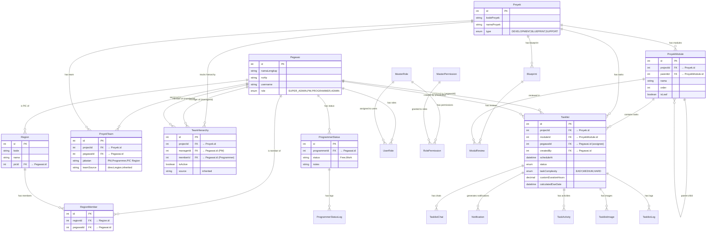

# Database ERD - Logbook System

## Core Entity Relationship Diagram



## Team Hierarchy System (Region-Enabled Projects)

### Team Source Types (`ProyekTeam.teamSource`)

| Value | Description |
|-------|-------------|
| `direct` | Regular team member (BLUEPRINT/DEV without region) |
| `region` | Added from region (SUPPORT or DEV with region enabled) |
| `inherited` | PM from original team, preserved when region enabled |

### TeamHierarchy Table

**Purpose:** Snapshot PM-Programmer relationships from original team before enabling region support

**Fields:**
- `projectId` - The project (SUPPORT or DEV with region)
- `managerId` - PM who managed programmer in original team
- `memberId` - Programmer who was managed
- `isActive` - Whether relationship is currently active
- `source` - Always "inherited" for preserved relationships

**Usage:**
1. **Enable Region:** Original team snapshot created
2. **Disable Region:** Team restored from snapshot
3. **Task Assignment:** Inherited PM can assign to hierarchy subordinates only

## Region Detection

**How to identify if a project has region support:**

Since `regionId` is not stored in the `Proyek` table, region support is detected by checking `ProyekTeam`:

```sql
-- Check if project has region team
SELECT * FROM proyek_team 
WHERE project_id = ? AND team_source = 'region'
LIMIT 1;
```

**To get the region ID:**
1. Find PIC Region member: `jabatan = 'PIC Region' AND teamSource = 'region'`
2. Match PIC's `pegawaiId` with `Region.picId`

## Project Type Transition Flows

### 1. BLUEPRINT → DEV (No Region)
```
Team: Preserved as-is (teamSource: 'direct')
Hierarchy: Not created
```

### 2. BLUEPRINT → DEV + Region ✨ NEW
```
1. Snapshot BLUEPRINT team to TeamHierarchy
2. Delete all ProyekTeam entries
3. Add Region PIC (teamSource: 'region')
4. Add Region programmers (teamSource: 'region')
5. Add inherited PMs (teamSource: 'inherited')
```

### 3. BLUEPRINT → SUPPORT ✨ NEW
```
1. Snapshot BLUEPRINT team to TeamHierarchy
2. Delete all ProyekTeam entries
3. Add Region PIC (teamSource: 'region')
4. Add Region programmers (teamSource: 'region')
5. Add inherited PMs (teamSource: 'inherited')
```

### 4. DEV → DEV + Region (Toggle ON)
```
1. Snapshot DEV team to TeamHierarchy
2. Delete all ProyekTeam entries
3. Add Region PIC (teamSource: 'region')
4. Add Region programmers (teamSource: 'region')
5. Add inherited PMs (teamSource: 'inherited')
```

### 5. DEV + Region → DEV (Toggle OFF)
```
1. Read active TeamHierarchy entries
2. Delete all ProyekTeam entries
3. Restore PMs and programmers from hierarchy
4. Set teamSource: 'direct'
5. Deactivate hierarchy entries (isActive: false)
```

### 6. DEV + Region ↔ SUPPORT
```
1. Keep TeamHierarchy active (no changes)
2. Delete only region members (teamSource: 'region')
3. Add new region members if region changed
4. Preserve inherited PMs (teamSource: 'inherited')
```

### 7. Any → BLUEPRINT
```
1. Read active TeamHierarchy entries (if exists)
2. Delete all ProyekTeam entries
3. Restore PMs and programmers from hierarchy
4. Set teamSource: 'direct'
5. Deactivate hierarchy entries (isActive: false)
```

## Task Visibility & Permission Rules

### Task Creator Tracking

**Field:** `Tasklist.createdBy` - Tracks who created the task

**Rules for SUPPORT/DEV+Region Projects:**

| Task Creator | Viewer | Can View? | Can Edit? | Buttons Shown? |
|--------------|--------|-----------|-----------|----------------|
| Inherited PM | PM (self) | ✅ Yes | ✅ Yes | ✅ Yes |
| Inherited PM | PIC | ✅ Yes | ❌ No (403) | ❌ Hidden |
| Inherited PM | Assignee | ✅ Yes | ✅ Yes | ✅ Yes |
| PIC | PIC (self) | ✅ Yes | ✅ Yes | ✅ Yes |
| PIC | PM | ❌ No | ❌ No (403) | ❌ Not visible |
| PIC | Assignee | ✅ Yes | ✅ Yes | ✅ Yes |

**Notes:**
- PM only sees tasks they created OR tasks assigned to their subordinates
- PIC sees all tasks (including PM tasks, but read-only)
- Assignee and creator always have full access
- Legacy tasks (createdBy = NULL) are accessible by everyone

## Complete Schema Summary

| Table | Purpose | Key Fields |
|-------|---------|------------|
| **Proyek** | Projects | `type` - BLUEPRINT/DEVELOPMENT/SUPPORT |
| **ProyekTeam** | Team assignments | `teamSource` - direct/region/inherited |
| **TeamHierarchy** | PM-Programmer relationships | `isActive` - tracks if hierarchy is active |
| **Tasklist** | Tasks | `createdBy` - enables permission control |
| **Region** | Regions | `picId` - identifies region via PIC |

## Implementation Status

✅ **Fully Implemented:**
1. Team hierarchy preservation (all transitions)
2. Task visibility filtering (PM sees limited, PIC sees all)
3. Task permission control (backend 403, frontend button hiding)
4. Role-based user assignment (inherited PM → subordinates)
5. Direct BLUEPRINT → DEV+region transition
6. Direct BLUEPRINT → SUPPORT transition
7. Checkbox & dropdown persistence in UI
8. Region detection via ProyekTeam (no regionId in Proyek)

## Migration Notes

**Breaking Change:** `regionId` removed from `Proyek` model

**Migration Path:**
- Old: `project.regionId` to get region
- New: Check `ProyekTeam` for `teamSource='region'`, find PIC Region, match with `Region.picId`

**Reason:** Consistency with SUPPORT project pattern where region is tracked via team members, not direct foreign key.
