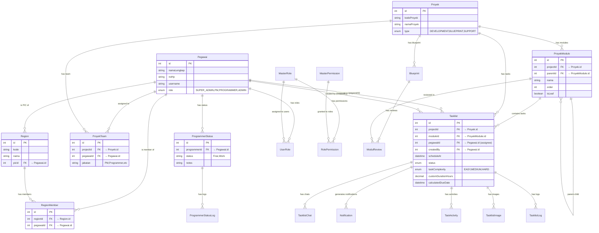
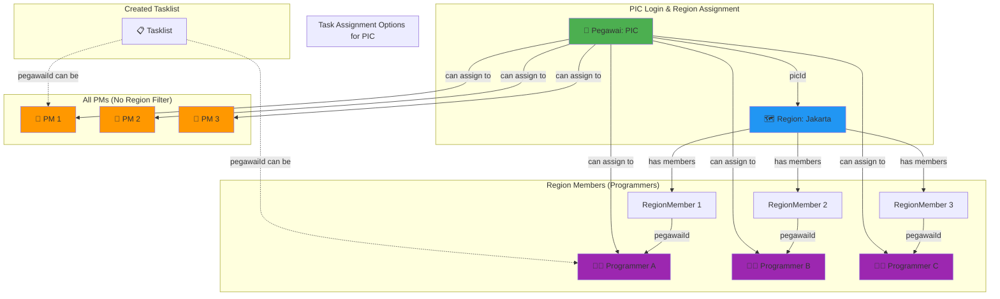

# Database ERD - Logbook System

## Core Entity Relationship Diagram



## PIC Assignment Flow - Detailed View



## Region-Based Access Control

```mermaid
graph LR
    subgraph "Region System"
        PIC[PIC]
        R1[Region A<br/>PIC: User X]
        R2[Region B<br/>PIC: User Y]
        
        PIC -->|manages| R1
        
        R1 -->|members| Prog1[Programmer 1]
        R1 -->|members| Prog2[Programmer 2]
        
        R2 -->|members| Prog3[Programmer 3]
        R2 -->|members| Prog4[Programmer 4]
    end
    
    subgraph "Task Assignment Rules"
        Rule1["✅ PIC can assign to:<br/>- All PMs<br/>- Own region programmers"]
        Rule2["❌ PIC cannot assign to:<br/>- Other region's programmers"]
    end
    
    PIC -.->|can assign| AllPM[All PMs]
    PIC -.->|can assign| Prog1
    PIC -.->|can assign| Prog2
    PIC -.x->|cannot assign| Prog3
    PIC -.x->|cannot assign| Prog4
    
    style PIC fill:#4CAF50
    style R1 fill:#2196F3
    style R2 fill:#E0E0E0
    style Prog1 fill:#9C27B0
    style Prog2 fill:#9C27B0
    style Prog3 fill:#BDBDBD
    style Prog4 fill:#BDBDBD
    style AllPM fill:#FF9800
    style Rule1 fill:#C8E6C9
    style Rule2 fill:#FFCDD2
```

## Key Relationships untuk PIC Feature

### 1. PIC → Region (One-to-One/Many)
- **Relasi**: `Region.picId` → `Pegawai.id`
- **Arti**: PIC yang bertanggung jawab atas region
- **Query**: `Region.findFirst({ where: { picId: session.id } })`

### 2. Region → RegionMember (One-to-Many)
- **Relasi**: `RegionMember.regionId` → `Region.id`
- **Arti**: Daftar member (programmer) di region tersebut

### 3. RegionMember → Pegawai (Many-to-One)
- **Relasi**: `RegionMember.pegawaiId` → `Pegawai.id`
- **Arti**: Programmer yang tergabung di region

### 4. Tasklist Assignment Logic

**Untuk PIC:**
```typescript
// Query available users for PIC to assign
const picRegion = await prisma.region.findFirst({
  where: { picId: session.id },
  include: {
    members: {
      include: { pegawai: true }
    }
  }
});

const allPMs = await prisma.pegawai.findMany({
  where: { role: 'PM' }
});

const picProgrammers = picRegion?.members.map(m => m.pegawai) || [];

// Combine: All PMs + Own Region Programmers
const availableUsers = [...allPMs, ...picProgrammers];
```

## Complete Schema Summary

| Table | Purpose | Key Relations |
|-------|---------|---------------|
| **Pegawai** | Users/Employees | Central entity, has role (SUPER_ADMIN/PM/PROGRAMMER/ADMIN) |
| **Region** | Regional divisions | Has PIC (Pegawai), contains RegionMembers |
| **RegionMember** | Region membership | Links Pegawai to Region |
| **ProyekTeam** | Project team assignments | Links Pegawai to Proyek with jabatan |
| **Tasklist** | Task items | Assigned to Pegawai, belongs to ProyekModule |
| **ProgrammerStatus** | Programmer availability | Tracks Free/Work status per programmer |
| **MasterRole** | RBAC roles | Linked to permissions via RolePermission |
| **MasterPermission** | RBAC permissions | Granular access control |

---

## Kesimpulan Relasi untuk PIC

✅ **Sudah Support**:
- PIC dapat di-link ke Region via `Region.picId`
- Region memiliki members (programmers) via `RegionMember`
- Query untuk get "All PMs + Own Region Programmers" sudah feasible

⚠️ **Yang Perlu Ditambah**:
1. Add `PIC` ke enum `Role` di Pegawai
2. Create API endpoint untuk get available users khusus PIC
3. Update permission/authorization logic untuk PIC role
