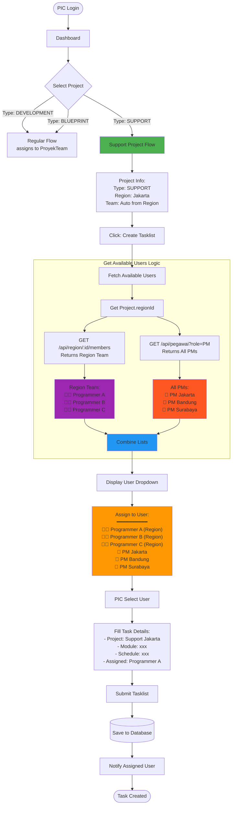
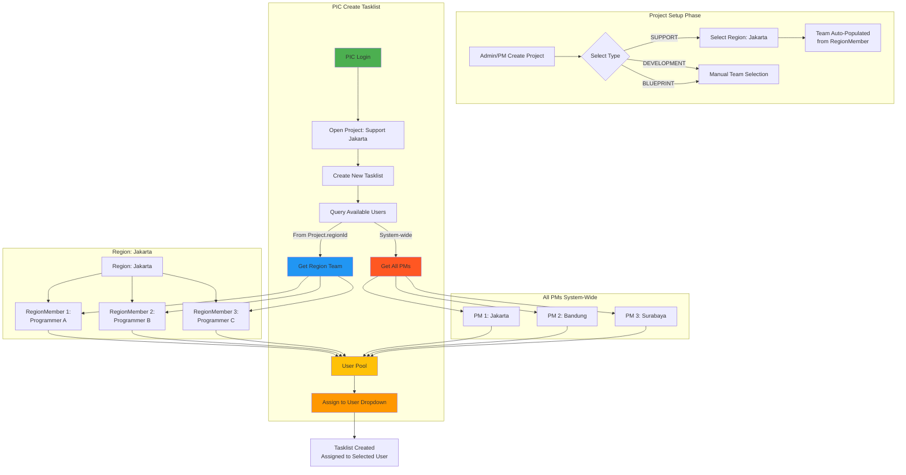
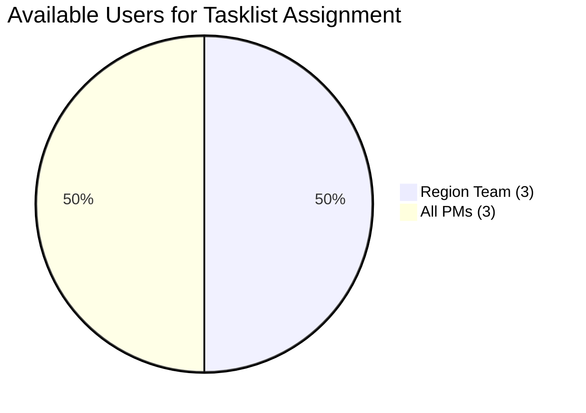

# PIC Tasklist Flow - Project Support

## Complete Flow: PIC Create Tasklist in SUPPORT Project



## Detailed User Assignment Logic



## Step-by-Step Example

### Setup: Project Support Jakarta

```
Proyek:
  id: 100
  namaProyek: "Support Jakarta"
  type: "SUPPORT"
  regionId: 1  ← Linked to Region Jakarta

Region (id: 1 - Jakarta):
  members:
    - RegionMember { pegawaiId: 10, pegawai: "Programmer A" }
    - RegionMember { pegawaiId: 11, pegawai: "Programmer B" }
    - RegionMember { pegawaiId: 12, pegawai: "Programmer C" }

ProyekTeam (Auto-populated from Region):
  - { projectId: 100, pegawaiId: 10 }
  - { projectId: 100, pegawaiId: 11 }
  - { projectId: 100, pegawaiId: 12 }
```

### PIC Create Tasklist

**Step 1: PIC opens project**
```
Project: Support Jakarta (type: SUPPORT, regionId: 1)
```

**Step 2: Click "Create Tasklist"**

**Step 3: System fetches available users**
```typescript
// Backend logic
const project = await prisma.proyek.findUnique({
  where: { id: 100 },
  include: { region: { include: { members: { include: { pegawai: true } } } } }
});

if (project.type === 'SUPPORT' && project.regionId) {
  // Get region team
  const regionTeam = project.region.members.map(m => ({
    id: m.pegawai.id,
    namaLengkap: m.pegawai.namaLengkap,
    source: 'region'
  }));
  
  // Get all PMs
  const allPMs = await prisma.pegawai.findMany({
    where: { role: 'PM' },
    select: { id: true, namaLengkap: true }
  }).map(pm => ({ ...pm, source: 'pm' }));
  
  // Combine
  const availableUsers = [...regionTeam, ...allPMs];
}

// Response:
{
  "availableUsers": [
    { "id": 10, "namaLengkap": "Programmer A", "source": "region" },
    { "id": 11, "namaLengkap": "Programmer B", "source": "region" },
    { "id": 12, "namaLengkap": "Programmer C", "source": "region" },
    { "id": 5, "namaLengkap": "PM Jakarta", "source": "pm" },
    { "id": 6, "namaLengkap": "PM Bandung", "source": "pm" },
    { "id": 7, "namaLengkap": "PM Surabaya", "source": "pm" }
  ]
}
```

**Step 4: PIC selects user from dropdown**
```
Selected: Programmer A (id: 10)
```

**Step 5: Submit tasklist**
```
POST /api/tasklist
{
  "projectId": 100,
  "moduleId": 5,
  "pegawaiId": 10,  ← Selected user
  "scheduleAt": "2025-11-29",
  "keterangan": "Fix bug di modul XYZ"
}
```

**Step 6: Task created**
```
Tasklist created:
  id: 500
  projectId: 100
  pegawaiId: 10 (Programmer A)
  status: MENUNGGU_PROSES_USER
```

## Comparison: SUPPORT vs DEVELOPMENT

| Aspect | SUPPORT Project | DEVELOPMENT Project |
|--------|----------------|---------------------|
| **Team Source** | Auto from RegionMember | Manual selection |
| **Tasklist Assignment** | Region Team + All PMs | ProyekTeam only |
| **PIC Role** | Can assign to region team + PMs | N/A |
| **Region Link** | Required (`regionId` set) | NULL |

## Visual: User Pool Composition



## API Endpoint Design

### GET /api/tasklist/available-users

```typescript
// Request
GET /api/tasklist/available-users?projectId=100

// Response
{
  "projectId": 100,
  "projectType": "SUPPORT",
  "regionId": 1,
  "regionName": "Jakarta",
  "users": [
    {
      "id": 10,
      "namaLengkap": "Programmer A",
      "role": "PROGRAMMER",
      "source": "region",
      "noHp": "08111"
    },
    {
      "id": 11,
      "namaLengkap": "Programmer B",
      "role": "PROGRAMMER",
      "source": "region",
      "noHp": "08222"
    },
    {
      "id": 5,
      "namaLengkap": "PM Jakarta",
      "role": "PM",
      "source": "all_pms",
      "noHp": "08999"
    }
  ]
}
```

## Summary

✅ **PIC di Project SUPPORT dapat assign tasklist ke:**
- ✅ Team dari Region (Programmer A, B, C)
- ✅ Semua PM yang ada di system

✅ **Auto-population:**
- ✅ ProyekTeam otomatis terisi dari RegionMember saat pilih type SUPPORT
- ✅ Dropdown user tasklist otomatis combine region team + all PMs

✅ **Validation:**
- ✅ Project type SUPPORT harus punya regionId
- ✅ User yang dipilih harus ada di available users list
