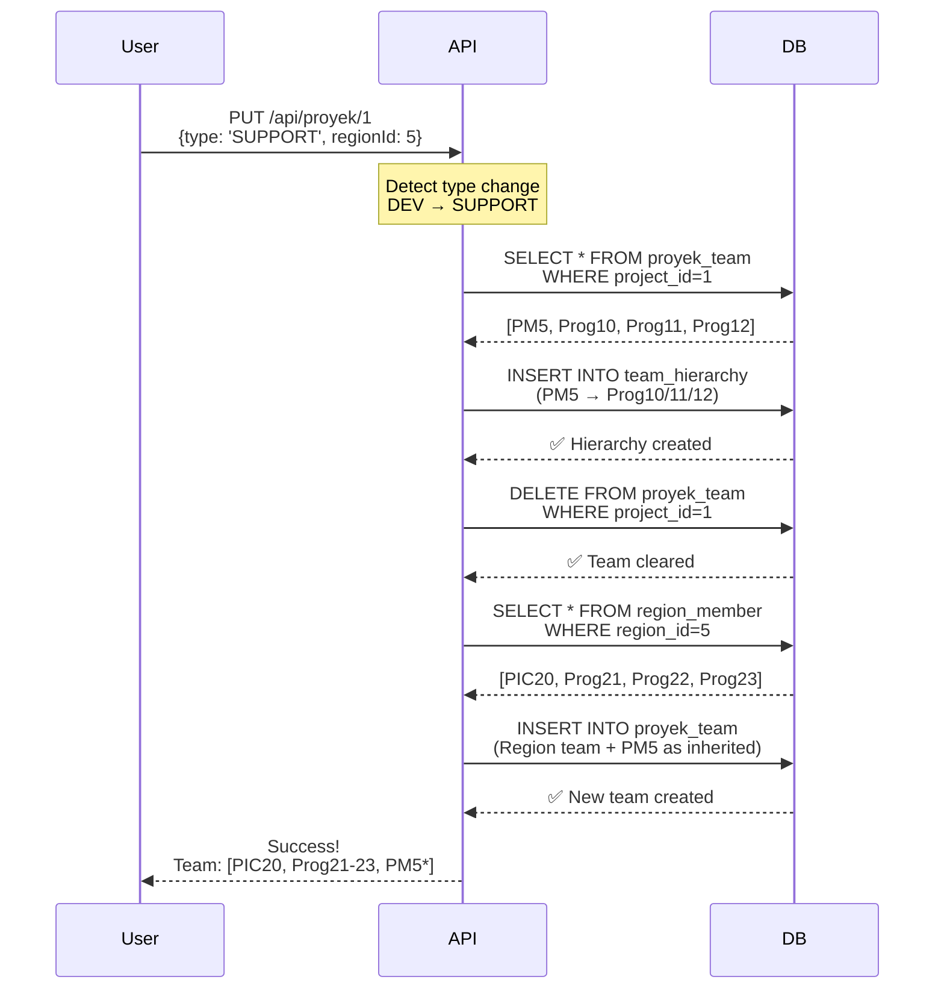
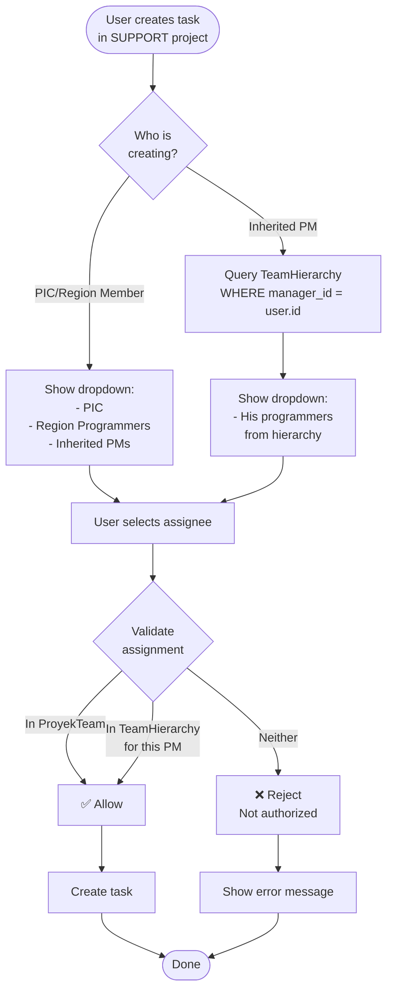
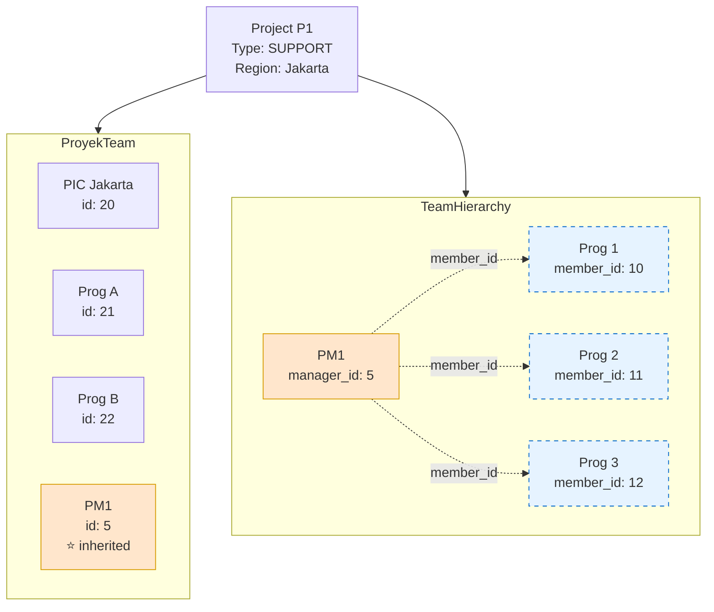

# Team Hierarchy Design for Region-Enabled Projects

## Overview

Ketika project berubah dari DEVELOPMENT → SUPPORT, atau DEVELOPMENT mengaktifkan region support, atau BLUEPRINT langsung ke SUPPORT/DEV+region, system akan preserve existing team structure (PM dan programmers) sambil menambahkan region team. PM yang ada di original team tetap bisa assign task ke programmer-nya sendiri, tapi tidak bisa assign ke programmer dari region.

**Supported Transitions:**
- BLUEPRINT → DEV+region (direct)
- BLUEPRINT → SUPPORT (direct)
- DEV → DEV+region (toggle ON)
- DEV+region → DEV (toggle OFF)
- DEV+region ↔ SUPPORT
- Any → BLUEPRINT (restore)

## PIC Task Creation Permission

**Problem**: PIC (Person In Charge) of a region can have role `PROGRAMMER` or `ADMIN`, which normally cannot create tasks due to RBAC restrictions.

**Solution**: Special permission check allows PIC to create and view tasks in their managed projects.

### Permission Rules

| User Role | Is PIC? | Can Create Task? | Can View Tasks | Scope |
|-----------|---------|------------------|----------------|-------|
| PM | - | ✅ Yes | All tasks in their projects | Team projects |
| SUPER_ADMIN | - | ✅ Yes | All tasks | System-wide |
| ADMIN | No | ❌ No | Only own tasks | Self only |
| ADMIN | ✅ Yes | ✅ Yes | All tasks in PIC projects | PIC projects |
| PROGRAMMER | No | ❌ No | Only own tasks | Self only |
| PROGRAMMER | ✅ Yes | ✅ Yes | All tasks in PIC projects | PIC projects |

### How It Works

**Backend Permission Check** (`/api/tasklist` POST - Line 643-675):
1. Check if user is PIC of any region (via `Region.picId`)
2. Check if project uses PIC's region (via `ProyekTeam` with `teamSource='region'` and `jabatan='PIC Region'`)
3. If YES → Allow task creation (bypass RBAC)
4. If NO → Return 403 error

**Backend Visibility Filter** (`/api/tasklist` GET - Line 136-169):
1. If user role is PROGRAMMER, check if they are PIC first
2. If PIC → Show all tasks in their managed projects (`projectId IN picProjects`)
3. If not PIC → Show only their own tasks (`pegawaiId = session.id`)

**Frontend Button Visibility** (`tasklist/page.tsx` - Line 2147):
```typescript
{(me?.role === 'PM' || me?.role === 'SUPER_ADMIN' || me?.role === 'ADMIN' || 
  (isPIC && picProjects.length > 0)) && (
  <button onClick={openAdd}>Tambah Task</button>
)}
```

**Frontend Project Filter** (`tasklist/page.tsx` - Line 2740-2747):
- PIC can only select projects where they are PIC Region
- Dropdown automatically filters to show only their managed projects

### Example Workflow

**Scenario**: User "Dummy User" (ID 1, role PROGRAMMER) is PIC of region "Solo"

1. **Login**: User logs in with PROGRAMMER role
2. **PIC Detection**: Frontend checks if user is PIC by querying `ProyekTeam` for `jabatan='PIC Region'`
3. **Button Visible**: "Tambah Task" button appears (normally hidden for PROGRAMMER)
4. **Create Task**: User clicks button, selects project "logbook v2" (uses Solo region)
5. **Backend Check**: API verifies user is PIC of Solo region AND project uses Solo region
6. **Task Created**: ✅ Task created successfully
7. **Dashboard View**: User can see ALL tasks in "logbook v2", not just their own

**Error Case**: PIC tries to create task in project that doesn't use their region
- Backend returns: `403 - "Anda hanya bisa membuat task di proyek yang menggunakan region Anda"`


## Database Schema

### Current Tables

#### ProyekTeam (Modified)
```sql
CREATE TABLE proyek_team (
  id SERIAL PRIMARY KEY,
  project_id INTEGER NOT NULL,
  pegawai_id INTEGER NOT NULL,
  jabatan VARCHAR(255) NOT NULL,
  team_source VARCHAR(50) DEFAULT 'direct', -- NEW FIELD
  created_at TIMESTAMP DEFAULT NOW(),
  updated_at TIMESTAMP DEFAULT NOW(),
  UNIQUE(project_id, pegawai_id)
);
```

**team_source values:**
- `'direct'` - Regular team member (DEV projects)
- `'region'` - Added from region (SUPPORT projects)
- `'inherited'` - PM from DEV phase, carried over to SUPPORT

---

### New Table

#### TeamHierarchy
```sql
CREATE TABLE team_hierarchy (
  id SERIAL PRIMARY KEY,
  project_id INTEGER NOT NULL,
  manager_id INTEGER NOT NULL,  -- PM who manages the member
  member_id INTEGER NOT NULL,   -- Programmer under this PM
  is_active BOOLEAN DEFAULT TRUE,
  source VARCHAR(50) DEFAULT 'inherited',
  created_at TIMESTAMP DEFAULT NOW(),
  updated_at TIMESTAMP DEFAULT NOW(),
  UNIQUE(project_id, manager_id, member_id),
  INDEX idx_project_manager (project_id, manager_id),
  INDEX idx_project_member (project_id, member_id)
);
```

**Purpose**: Menyimpan relasi PM → Programmers ketika project type berubah ke SUPPORT

---

## Data Flow Examples

### Example 1: DEVELOPMENT Project

**Initial State:**
```
Project: P1 (Type: DEVELOPMENT)
```

**ProyekTeam:**
```
id | project_id | pegawai_id | jabatan     | team_source
---+------------+------------+-------------+-------------
1  | 1          | 5          | PM          | direct
2  | 1          | 10         | Programmer  | direct
3  | 1          | 11         | Programmer  | direct
4  | 1          | 12         | Programmer  | direct
```

**TeamHierarchy:**
```
(empty - not needed for DEV projects)
```

---

### Example 2: DEVELOPMENT → SUPPORT Migration

**User Action:**
```
Edit Project P1:
- Type: DEVELOPMENT → SUPPORT
- Region: Jakarta (PIC: id=20, Members: id=21,22,23)
```

**Step 1: Create Hierarchy Snapshot**

System creates TeamHierarchy entries to preserve PM → Programmer relationship:

```
id | project_id | manager_id | member_id | is_active | source
---+------------+------------+-----------+-----------+-----------
1  | 1          | 5          | 10        | true      | inherited
2  | 1          | 5          | 11        | true      | inherited
3  | 1          | 5          | 12        | true      | inherited
```

**Step 2: Clear and Rebuild ProyekTeam**

Delete existing team, then add:
1. Region PIC + Members
2. Inherited PM (marked as 'inherited')

```
id | project_id | pegawai_id | jabatan      | team_source
---+------------+------------+--------------+-------------
5  | 1          | 20         | PIC Region   | region
6  | 1          | 21         | Programmer   | region
7  | 1          | 22         | Programmer   | region
8  | 1          | 23         | Programmer   | region
9  | 1          | 5          | PM           | inherited
```

**Result:**
- ✅ PM (id=5) visible in team with 'inherited' marker
- ✅ Prog 10,11,12 NOT in ProyekTeam (hidden)
- ✅ Prog 10,11,12 accessible via TeamHierarchy (PM5 can still assign)

---

### Example 3: SUPPORT → DEVELOPMENT Rollback

**User Action:**
```
Edit Project P1:
- Type: SUPPORT → DEVELOPMENT
```

**Step 1: Read Hierarchy**

System reads TeamHierarchy to get original team:
```
Manager: id=5 (PM)
Members: id=10,11,12 (Programmers)
```

**Step 2: Rebuild Original Team**

Clear ProyekTeam and restore:

```
id | project_id | pegawai_id | jabatan     | team_source
---+------------+------------+-------------+-------------
10 | 1          | 5          | PM          | direct
11 | 1          | 10         | Programmer  | direct
12 | 1          | 11         | Programmer  | direct
13 | 1          | 12         | Programmer  | direct
```

**Step 3: Deactivate Hierarchy**

Mark TeamHierarchy as inactive (keep for audit):

```
UPDATE team_hierarchy 
SET is_active = false 
WHERE project_id = 1;
```

---

## Workflow Diagrams

### Workflow 1: DEV → SUPPORT Migration



---

### Workflow 2: Task Assignment in SUPPORT Project



---

### Workflow 3: View Task Assignment Scope



**Legend:**
- 🟦 **ProyekTeam** - Visible team members
- 🟨 **PM1** - Inherited PM (marked with ⭐)
- 🔵 **TeamHierarchy** - Hidden but accessible programmers (dashed)

---

## Assignment Rules Matrix

| Creator Role | Project Type | Can Assign To | Validation Source |
|-------------|-------------|---------------|-------------------|
| PIC (Region) | SUPPORT | Region team + Inherited PMs | ProyekTeam WHERE teamSource IN ('region', 'inherited') |
| Inherited PM | SUPPORT | His subordinates only | TeamHierarchy WHERE managerId = PM.id |
| PM | DEVELOPMENT | All team members | ProyekTeam WHERE projectId = X |
| Programmer | Any | Not allowed to create tasks | N/A |

---

## API Endpoints

### GET /api/tasklist/assignable-users

**Request:**
```
GET /api/tasklist/assignable-users?projectId=1&requesterId=20
```

**Response (PIC requesting in SUPPORT project):**
```json
{
  "projectId": 1,
  "projectType": "SUPPORT",
  "requesterRole": "PIC",
  "users": [
    { "id": 20, "namaLengkap": "PIC Jakarta", "source": "region" },
    { "id": 21, "namaLengkap": "Prog A", "source": "region" },
    { "id": 22, "namaLengkap": "Prog B", "source": "region" },
    { "id": 5, "namaLengkap": "PM1", "source": "inherited" }
  ]
}
```

**Response (Inherited PM requesting in SUPPORT project):**
```json
{
  "projectId": 1,
  "projectType": "SUPPORT",
  "requesterRole": "PM",
  "users": [
    { "id": 10, "namaLengkap": "Prog 1", "source": "hierarchy" },
    { "id": 11, "namaLengkap": "Prog 2", "source": "hierarchy" },
    { "id": 12, "namaLengkap": "Prog 3", "source": "hierarchy" }
  ]
}
```

---

## Edge Cases & Considerations

### Multiple PMs in DEV

**Scenario:**
```
DEV Project has:
- PM1 → Prog1, Prog2
- PM2 → Prog3, Prog4
```

**After SUPPORT migration:**

TeamHierarchy:
```
manager_id | member_id
-----------+-----------
5 (PM1)    | 10 (Prog1)
5 (PM1)    | 11 (Prog2)
6 (PM2)    | 12 (Prog3)
6 (PM2)    | 13 (Prog4)
```

ProyekTeam:
```
PIC + Region Team
+ PM1 (inherited)
+ PM2 (inherited)
```

Both PM1 and PM2 can assign to their respective programmers only.

---

### View Permissions

**PIC/Region Members:**
- ✅ Can VIEW all tasks (including PM1 → Prog1/2/3)
- ❌ Cannot ASSIGN to Prog1/2/3 directly
- ✅ Can ASSIGN to Region team + PMs

**Inherited PM:**
- ✅ Can VIEW all tasks in project
- ✅ Can ASSIGN to his subordinates
- ❌ Cannot ASSIGN to region programmers

---

## Implementation Checklist

### Database
- [ ] Add `team_source` column to `proyek_team`
- [ ] Create `team_hierarchy` table
- [ ] Create migration script
- [ ] Add indexes for performance

### Backend API
- [ ] Update PUT `/api/proyek/[id]` with type change detection
- [ ] Implement `handleDevToSupport()` function
- [ ] Implement `handleSupportToDev()` function
- [ ] Create GET `/api/tasklist/assignable-users` endpoint
- [ ] Update POST `/api/tasklist` validation logic

### Frontend
- [ ] Update tasklist form to use new endpoint
- [ ] Show inherited PM badge in team panel (optional)
- [ ] Add collapsible section for hierarchy view (future enhancement)

### Testing
- [ ] Test DEV → SUPPORT migration
- [ ] Test SUPPORT → DEV rollback
- [ ] Test task assignment by PIC
- [ ] Test task assignment by inherited PM
- [ ] Test validation (reject unauthorized assignment)
- [ ] Test with multiple PMs scenario

---

## Migration Example Data

### Before (DEVELOPMENT)

**Project P1:**
```
Type: DEVELOPMENT
```

**proyek_team:**
| id | project_id | pegawai_id | jabatan | team_source |
|----|------------|------------|---------|-------------|
| 1 | 1 | 5 | PM | direct |
| 2 | 1 | 10 | Programmer | direct |
| 3 | 1 | 11 | Programmer | direct |

**team_hierarchy:** (empty)

---

### After (SUPPORT - Region Jakarta)

**Project P1:**
```
Type: SUPPORT
Region: Jakarta (PIC: 20, Members: 21, 22)
```

**proyek_team:**
| id | project_id | pegawai_id | jabatan | team_source |
|----|------------|------------|---------|-------------|
| 4 | 1 | 20 | PIC Region | region |
| 5 | 1 | 21 | Programmer | region |
| 6 | 1 | 22 | Programmer | region |
| 7 | 1 | 5 | PM | **inherited** |

**team_hierarchy:**
| id | project_id | manager_id | member_id | is_active | source |
|----|------------|------------|-----------|-----------|---------|
| 1 | 1 | 5 | 10 | true | inherited |
| 2 | 1 | 5 | 11 | true | inherited |

---

## Future Enhancements

1. **Team Panel UI**: Show collapsible section for inherited teams
2. **Badges**: Visual indicator for inherited PMs
3. **Bulk Operations**: Migrate multiple projects at once
4. **Analytics**: Report on team efficiency across hierarchy
5. **Notifications**: Alert PMs when their scope changes
