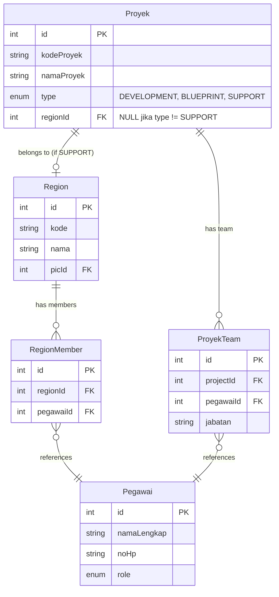

# Schema Design: Proyek Support dengan Region

## Entity Relationship Diagram



## Flow Diagram: Create/Edit Project Type SUPPORT

```mermaid
flowchart TD
    Start[Edit Proyek] --> SelectType{Pilih Type}
    
    SelectType -->|DEVELOPMENT| HideRegion[Region Dropdown: Hidden]
    SelectType -->|BLUEPRINT| HideRegion
    SelectType -->|SUPPORT| ShowRegion[Region Dropdown: Visible]
    
    ShowRegion --> LoadRegions[Load All Regions<br/>GET /api/region]
    LoadRegions --> DisplayRegions[Display:<br/>- Jakarta<br/>- Bandung<br/>- Surabaya]
    
    DisplayRegions --> UserSelect[User Pilih Region]
    UserSelect --> FetchMembers[Fetch Region Members<br/>GET /api/region/[id]/members]
    
    FetchMembers --> AutoPopulate[Auto-populate ProyekTeam<br/>dari RegionMember]
    AutoPopulate --> SaveProject[Save Proyek dengan regionId]
    
    HideRegion --> SaveProject2[Save Proyek<br/>regionId = NULL]
    
    style ShowRegion fill:#4CAF50
    style AutoPopulate fill:#2196F3
    style FetchMembers fill:#FF9800
```

## Updated Prisma Schema

### Proyek Model (Changes)

```prisma
model Proyek {
  id         Int         @id @default(autoincrement())
  noUrut     Int         @unique
  kodeProyek String      @unique
  namaProyek String
  createdAt  DateTime    @default(now())
  updatedAt  DateTime    @updatedAt
  client     String?
  pic        String?
  type       ProjectType @default(DEVELOPMENT)
  
  // 🆕 NEW FIELD
  regionId   Int?        // Optional: only for type SUPPORT
  
  // 🆕 NEW RELATION
  region     Region?     @relation(fields: [regionId], references: [id], onDelete: SetNull)
  
  // Existing relations
  blueprints Blueprint[]
  eutTests   EutTest[]
  goLive     GoLive?
  uatTests   UatTest[]

  @@map("proyek")
}
```

### Region Model (Changes)

```prisma
model Region {
  id        Int      @id @default(autoincrement())
  kode      String   @unique
  nama      String
  picId     Int
  createdAt DateTime @default(now())
  updatedAt DateTime @updatedAt
  
  pic       Pegawai        @relation("RegionPic", fields: [picId], references: [id], onDelete: Restrict)
  members   RegionMember[]
  
  // 🆕 NEW RELATION
  projects  Proyek[]       // Projects of type SUPPORT linked to this region

  @@index([picId])
  @@map("region")
}
```

## Data Flow Example

### Case 1: Create Project Type SUPPORT

```typescript
// Step 1: User selects type = SUPPORT
// Frontend shows Region dropdown

// Step 2: Load all regions
GET /api/region
Response: [
  { id: 1, nama: "Jakarta", kode: "JKT" },
  { id: 2, nama: "Bandung", kode: "BDG" },
  { id: 3, nama: "Surabaya", kode: "SBY" }
]

// Step 3: User selects Jakarta (id: 1)
// Load region members
GET /api/region/1/members
Response: {
  regionId: 1,
  regionName: "Jakarta",
  members: [
    { id: 10, namaLengkap: "Programmer A", noHp: "08111" },
    { id: 11, namaLengkap: "Programmer B", noHp: "08222" },
    { id: 12, namaLengkap: "Programmer C", noHp: "08333" }
  ]
}

// Step 4: Auto-populate team
// Frontend auto-fills ProyekTeam dengan members dari region

// Step 5: Save project
POST /api/proyek
{
  kodeProyek: "SUP-001",
  namaProyek: "Support Jakarta",
  type: "SUPPORT",
  regionId: 1,  // ← Region dipilih
  team: [
    { pegawaiId: 10, jabatan: "Programmer" },
    { pegawaiId: 11, jabatan: "Programmer" },
    { pegawaiId: 12, jabatan: "Programmer" }
  ]
}

// Database result:
proyek: { id: 100, type: "SUPPORT", regionId: 1 }
proyek_team: [
  { projectId: 100, pegawaiId: 10 },
  { projectId: 100, pegawaiId: 11 },
  { projectId: 100, pegawaiId: 12 }
]
```

### Case 2: Create Project Type DEVELOPMENT (No Region)

```typescript
POST /api/proyek
{
  kodeProyek: "DEV-001",
  namaProyek: "Development Project",
  type: "DEVELOPMENT",
  regionId: null,  // ← No region for non-SUPPORT
  team: [
    { pegawaiId: 5, jabatan: "PM" },
    { pegawaiId: 20, jabatan: "Programmer" }
  ]
}

// Database result:
proyek: { id: 101, type: "DEVELOPMENT", regionId: NULL }
proyek_team: [
  { projectId: 101, pegawaiId: 5 },
  { projectId: 101, pegawaiId: 20 }
]
```

## Database Rules

| Field | Type | Rule |
|-------|------|------|
| `Proyek.regionId` | `Int?` | **NULL** if `type != 'SUPPORT'`<br/>**Required** if `type = 'SUPPORT'` |
| `Proyek.type` | `Enum` | DEVELOPMENT, BLUEPRINT, SUPPORT |
| `Region.id` | `Int` | Must exist before assigning to Proyek |

## API Endpoints Needed

### 1. Get All Regions
```
GET /api/region
Response: [{ id, kode, nama, picId }]
```

### 2. Get Region Members
```
GET /api/region/[id]/members
Response: {
  regionId: number,
  regionName: string,
  members: [{ id, namaLengkap, noHp }]
}
```

### 3. Create/Update Project
```
POST/PUT /api/proyek
Body: {
  type: "SUPPORT",
  regionId: 1,  // ← Include when type = SUPPORT
  team: [...]
}
```

## Migration SQL

```sql
-- Add regionId column to proyek table
ALTER TABLE proyek 
ADD COLUMN "regionId" INTEGER;

-- Add foreign key constraint
ALTER TABLE proyek 
ADD CONSTRAINT fk_proyek_region 
FOREIGN KEY ("regionId") 
REFERENCES region(id) 
ON DELETE SET NULL;

-- Add index for performance
CREATE INDEX idx_proyek_region ON proyek("regionId");
```

## Validation Rules

```typescript
// Backend validation
if (type === 'SUPPORT') {
  if (!regionId) {
    throw new Error('Region is required for SUPPORT projects');
  }
  
  // Verify region exists
  const region = await prisma.region.findUnique({
    where: { id: regionId }
  });
  
  if (!region) {
    throw new Error('Invalid region ID');
  }
}

// For non-SUPPORT types, regionId should be null
if (type !== 'SUPPORT' && regionId !== null) {
  throw new Error('Region can only be set for SUPPORT projects');
}
```

## Summary

✅ **Proyek** dapat link ke **Region** (optional, hanya untuk type SUPPORT)  
✅ **Region** punya multiple **RegionMember** (programmers)  
✅ Ketika pilih Region, auto-populate **ProyekTeam** dari **RegionMember**  
✅ Tidak perlu role baru, pakai existing region system  
✅ Backward compatible: existing projects tidak terpengaruh (regionId = NULL)
